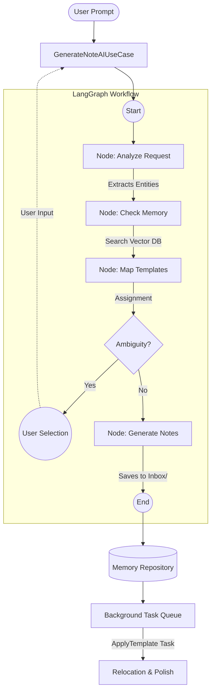

# Memory Creation Workflow

This document describes how the Elo assistant creates new notes (Memories) from natural language prompts.

## Architecture

The system uses a **LangGraph** workflow to decompose user intent into structured note data.

## Step-by-Step Breakdown

### 1. Extraction (`analyze_request`)

The AI identifies entities (Concepts, Persons, Books, etc.) in the prompt.

- **Reference**: `elo-config.json` → `frontmatterRegistry`.
- **Output**: Structured list of entities with extracted attributes.

### 2. De-duplication (`check_memory`)

The system queries **ChromaDB** to see if a note with a similar name or content already exists. This prevents cluttering the vault with duplicates.

### 3. Template Mapping (`map_templates`)

The system maps each entity to an Obsidian template (`!!config/templates/`).

- **Confident Match**: Auto-assigned if confidence $\ge$ 0.8.
- **Needs Selection**: If multiple templates fit, the AI will ask for clarification.

### 4. Generation (`generate_notes`)

The AI generates the initial draft content.

- **Rules**:
  - Saves strictly to the `Inbox/` directory first.
  - Minimal body content (facts only).
  - Obsidian wikilinks (`[[...]]`) for related entities.

### 5. Post-Processing (`ApplyTemplateAIUseCase`)

A background worker processes the draft to:

- Apply the strict layout and logic of the chosen template.
- Move the note from `Inbox/` to its final directory based on its metadata.

---

## Technical Details

- **Input Adapter**: `GenerateNoteAIUseCase`
- **Engine**: `NoteCreatorGraph.ts`
- **Prompts**: Defined in `src/infrastructure/Prompts/NoteCreatorPrompts.ts`
