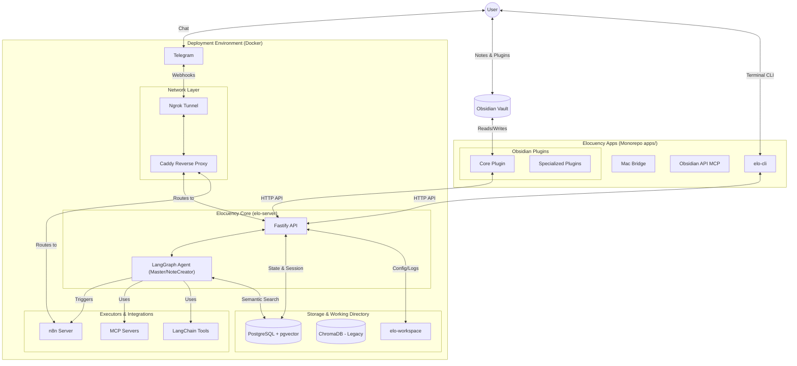

# Elocuency: The Personal Agent

**Powerful · Extensible · Secure**

_By Jesús A. Carballo Santaclara_

---

## Vision: Where are we going?

Elocuency is designed to be a personal assistant that helps you organize your life (a "Life Operating System"). It is accessible through natural language from any platform and serves as a digital twin with:

- A deep knowledge base about your personal context.
- Integration with your management tools (calendar, email, etc.).
- Proactive management of your personal affairs and tasks.

## Current State: Where are we today?

Currently, Elocuency allows you to:

- Interact with your knowledge base via **Telegram**.
- Query an **Obsidian Vault** using natural language.
- Use specialized plugins to easily maintain and enrich your knowledge.
- Build upon a secure, modular, and extensible development environment.

## Architecture

Elocuency is built as a single, modular **pnpm monorepo**. This structure simplifies dependency management while enabling the use of multiple technologies (TypeScript, Python, Swift), and allowing shared code between libraries and applications.

The high-level architecture is organized as follows:

### Core Architecture Principles

- **Extensible**: Developers can add new apps and plugins easily.
- **Secure**: Designed to protect end-user data.
- **Architecture**: Strictly adheres to SOLID principles and Hexagonal Architecture.
- **Configurable & Multilanguage**: Built to adapt across Python, TypeScript, and Swift.
- **Decoupled**: Apps have zero dependencies on each other unless strictly required.

---

## App Highlights (`apps/`)

Apps are the main entry points for the user. They provide user interfaces and distinct functionality. Each app builds its own artifact and can be distributed independently, relying on shared libraries but not on other apps.

- **`elo-server`**: The **TypeScript (Node.js)** application serving as the brain. Built with **Fastify** and **LangGraph**, it follows Hexagonal Architecture to orchestrate complex tasks like [Memory Creation](Memory-Creation.md), entity extraction, and multi-turn conversations.
- **`elo-cli`**: The command-line interface allowing users and developers to interact with the Elocuency environment directly from the terminal.
- **`elo-obsidian-api-mcp`**: A specialized server implementing the **Model Context Protocol (MCP)** to expose Obsidian's Local REST API safely to any AI model.
- **Obsidian Plugins**:
  - `elo-obsidian-core-plugin`: The foundational piece that bridges the user's local notes with the Elocuency backend.
  - Specialized Plugins: Micro-plugins like `elo-obsidian-spotify-plugin`, `elo-obsidian-youtube-plugin`, `elo-obsidian-google-maps-plugin`, `elo-obsidian-google-contacts-plugin`, `elo-obsidian-quiz-plugin`, `elo-obsidian-subtitles-plugin`, and `elo-obsidian-mac-bridge-plugin` to enrich knowledge easily.
- **`elo-mac-bridge`**: A specialized app facilitating deep integrations specific to the macOS environment.

## Shared Libraries (`libs/`)

Libraries provide the foundational, shared code utilized across multiple applications within the monorepo.

- `core-typescript`: Reusable TypeScript types, interfaces, and core domain logic using Hexagonal Architecture.
- `core-python`: Legacy/Shared Python logic (being transitioned to TypeScript).
- `obsidian-plugin`: Shared utilities specifically crafted for building modular Obsidian plugins.
- `core-swift`: Core utilities used for iOS/macOS specific functionalities.

## Deployment & Infrastructure

- **Containerization**: Everything runs in an isolated, consistent **Docker** environment.
- **Connectivity**: **Ngrok** tunnels external traffic, and **Caddy** acts as a reverse proxy routing to the API, n8n, and web interfaces.
- **Data & Storage**:
- **PostgreSQL (pgvector)**: The primary persistent database, handling structured state, chat history, and semantic vector storage via `pgvector`.
- **ChromaDB**: Secondary/Legacy vector database (transitioning to pgvector).
- **`elo-workspace/`**: The localized primary working directory for logs, configuration (`elo-config.json`), and persisted states.

---

## Developer Onboarding: Where to begin?

If you are new to the project and looking to contribute or understand the flow:

1. **Start with the Core Server**: Head to `apps/elo-server/src` to see the **TypeScript/LangGraph** implementation.
2. **Explore Obsidian Integration**: Look at `apps/elo-obsidian-core-plugin` and `libs/obsidian-plugin` to understand how the local Markdown Vault syncs context with the agent.
3. **IDE Setup**: Make sure you open the workspace in Visual Studio Code. The project contains recommended extensions (like Mermaid Chart and Excalidraw) in `.vscode/extensions.json` to configure your environment automatically.
4. **Tooling Check**: Use **`pnpm`** exclusively for package management. Run `elo --help` in the terminal to explore the internal CLI capabilities.
5. **Database**: Ensure you have the `pgvector` container running (via `docker compose up -d pgvector`) for all indexing operations.
