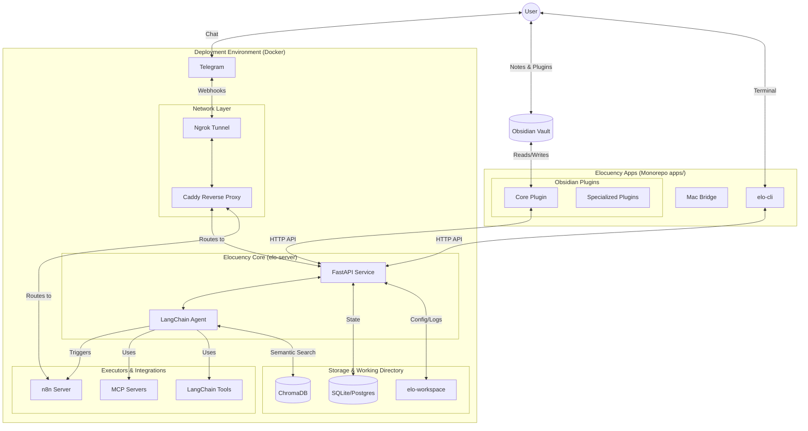

# Elocuency: The Personal Agent

**Powerful · Extensible · Secure**

_By Jesús A. Carballo Santaclara_

---

## Vision: Where are we going?

Elocuency is designed to be a personal assistant that helps you organize your life (a "Life Operating System"). It is accessible through natural language from any platform and serves as a digital twin with:

- A deep knowledge base about your personal context.
- Integration with your management tools (calendar, email, etc.).
- Proactive management of your personal affairs and tasks.

## Current State: Where are we today?

Currently, Elocuency allows you to:

- Interact with your knowledge base via **Telegram**.
- Query an **Obsidian Vault** using natural language.
- Use specialized plugins to easily maintain and enrich your knowledge.
- Build upon a secure, modular, and extensible development environment.

## Architecture

Elocuency is built as a single, modular **pnpm monorepo**. This structure simplifies dependency management while enabling the use of multiple technologies (TypeScript, Python, Swift), and allowing shared code between libraries and applications.

The high-level architecture is organized as follows:

### Core Architecture Principles

- **Extensible**: Developers can add new apps and plugins easily.
- **Secure**: Designed to protect end-user data.
- **Architecture**: Strictly adheres to SOLID principles and Hexagonal Architecture.
- **Configurable & Multilanguage**: Built to adapt across Python, TypeScript, and Swift.
- **Decoupled**: Apps have zero dependencies on each other unless strictly required.

---

## App Highlights (`apps/`)

Apps are the main entry points for the user. They provide user interfaces and distinct functionality. Each app builds its own artifact and can be distributed independently, relying on shared libraries but not on other apps.

- **`elo-server`**: The Python FastAPI application serving as the brain. It contains the LangChain agent, input adapters (Web APIs), and output adapters communicating with Obsidian, n8n, and MCPs.
- **`elo-cli`**: The command-line interface allowing users and developers to interact with the Elocuency environment directly from the terminal.
- **Obsidian Plugins**:
  - `elo-obsidian-core-plugin`: The foundational piece that bridges the user's local notes with the Elocuency backend.
  - Specialized Plugins: Micro-plugins like `elo-obsidian-spotify-plugin`, `elo-obsidian-youtube-plugin`, and `elo-obsidian-google-maps-plugin` to enrich knowledge easily.
- **`elo-mac-bridge`**: A specialized app facilitating deep integrations specific to the macOS environment.

## Shared Libraries (`libs/`)

Libraries provide the foundational, shared code utilized across multiple applications within the monorepo.

- `core-typescript`: Reusable TypeScript functions, schemas, and utilities.
- `core-python`: Shared Python logic for the server side.
- `obsidian-plugin`: Shared utilities specifically crafted for building modular Obsidian plugins.
- `core-swift`: Core utilities used for iOS/macOS specific functionalities.

## Deployment & Infrastructure

- **Containerization**: Everything runs in an isolated, consistent **Docker** environment.
- **Connectivity**: **Ngrok** tunnels external traffic, and **Caddy** acts as a reverse proxy routing to the API, n8n, and web interfaces.
- **Data & Storage**:
  - **ChromaDB**: Persistent vector database powering semantic search over private notes.
  - **Relational DB**: Uses SQLite for temporary data (with planned PostgreSQL support).
  - **`elo-workspace/`**: The localized primary working directory for logs, configuration (`elo-config.json`), and persisted states.

---

## Developer Onboarding: Where to begin?

If you are new to the project and looking to contribute or understand the flow:

1. **Start with the Core Server**: Head to `apps/elo-server` to see how the FastAPI backend and LangChain agents are built.
2. **Explore Obsidian Integration**: Look at `apps/elo-obsidian-core-plugin` and `libs/obsidian-plugin` to understand how the local Markdown Vault syncs context with the agent.
3. **IDE Setup**: Make sure you open the workspace in Visual Studio Code. The project contains recommended extensions (like Mermaid Chart and Excalidraw) in `.vscode/extensions.json` to configure your environment automatically.
4. **Tooling Check**: Run `elo --help` in the terminal to explore the internal CLI capabilities that manage the services.
